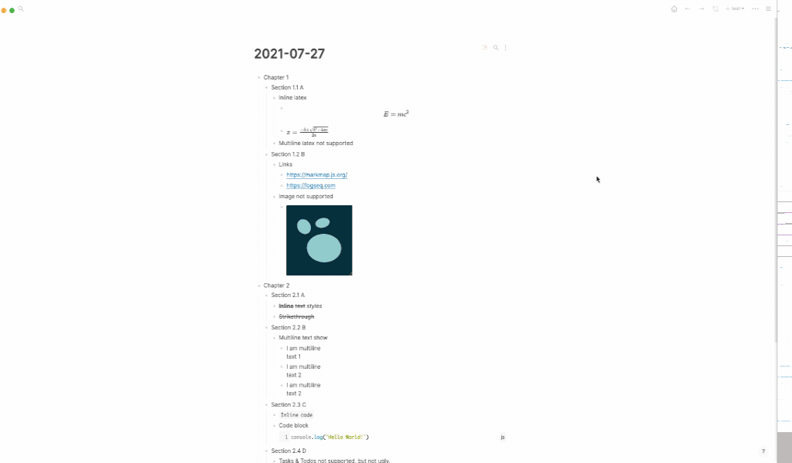

# Logseq Markmap Plugin



This is a plugin for [Logseq](https://github.com/logseq/logseq) to provide mindmap support based on [Markmap](https://github.com/gera2ld/markmap).

## Installation and Usage

```
npm install
npm run build:prod # For real
npm run build # For development
```

load unpack plugin from `dist` directory

## Stack

* Typescript
* Tailwind
* Markmap related packages

## Features

Most of features come from `Markmap` project.

* Colorful mindmap items.
* Markmap toolbar included.
* Support inline code and code block.
* Support inline text styles.
* Support normal links.
* Support inline latex syntax.
* Support mouse drag and drop, double click, scrollwheel zoom.

## Notes

* The mindmap is not editable.
* Properies are ignored.
* `#` Tags are ignored.
* Text length is unlimited.
* `#` head markdown syntax is ignored, use hierarchical blocks instead.
* image not supported.
* Hiccup not supported.
* Logseq embeded feature not supported.
* Only tested on `Markdown` mode, not `Org` mode, sorry!
* Tested on Logseq `v0.2.8` with the temp plugin infrastructure.

## Shortcuts

* `space`: fit window in center in case you move or zoom it.
* `0`: hide all except the central one.
* `9`: show all.
* `1`: expand to level 1.
* `2`: expand to level 2.
* `3`: expand to level 3.
* `4`: expand to level 4.
* `5`: expand to level 5.
* `+`: zoom in.
* `-`: zoom out.
* `h`: level up.
* `l`: level down.
* `ESC`: close the mindmap.
* `q`: close the mindmap.
## Contribution

Issues and PRs are welcome!

## Licence

MIT
